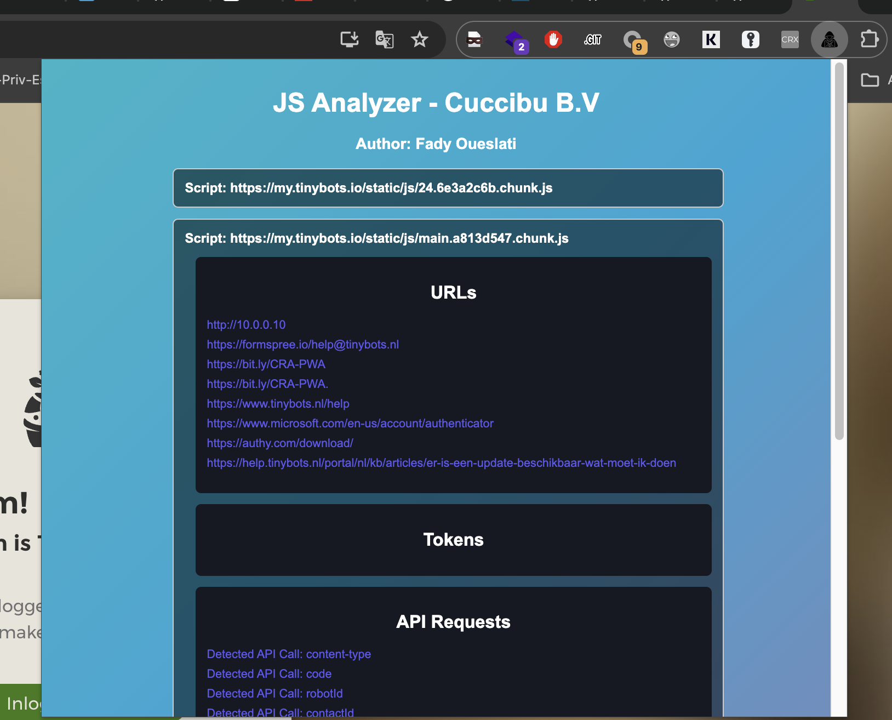

# JS Analyzer Chrome Extension

JS Analyzer is a Chrome extension designed to analyze JavaScript files on any webpage you visit. It provides detailed information about API endpoints, tokens, cookies, headers, and file paths found within the JavaScript files. This tool was inspired by the paid extension [js-miner](https://github.com/PortSwigger/js-miner/) made for Burp Suite Pro.

## Features

- **API Endpoint Detection**: Detects and lists various API endpoints (GET, POST, PUT, DELETE, PATCH) used in JavaScript files.
- **Token Extraction**: Extracts and displays tokens such as JWTs found in the JavaScript code.
- **Cookie Detection**: Identifies cookies created or modified by the JavaScript files.
- **Header Detection**: Captures and lists HTTP headers set by the JavaScript files.
- **File Path Extraction**: Lists various file paths referenced within the JavaScript code.
- **Storage Usage**: Detects and lists usage of localStorage and sessionStorage.
- **Responsive Design**: User-friendly and responsive popup interface.
- **Glowing Effect**: Highlighted sections for better readability.

## Installation

1. Clone or download this repository.
2. Open Chrome and navigate to `chrome://extensions/`.
3. Enable "Developer mode" by clicking the toggle switch in the top-right corner.
4. Click the "Load unpacked" button and select the directory where you cloned/downloaded this repository.

## Usage

1. Click on the JS Analyzer extension icon in your Chrome toolbar.
2. The extension will automatically analyze the JavaScript files on the current webpage.
3. Click on any script URL to view detailed information about the endpoints, tokens, cookies, headers, and file paths.

## Screenshots

## Author

This project was created by Cuccibu B.V., and I am the author. The project is open source, and contributions are welcome!

## License

This project is licensed under the MIT License. See the [LICENSE](LICENSE) file for details.

## Acknowledgements

This tool was inspired by the [js-miner](https://github.com/PortSwigger/js-miner/) extension made for Burp Suite Pro.

## Contributing

1. Fork the repository.
2. Create a new branch (`git checkout -b feature-branch`).
3. Make your changes.
4. Commit your changes (`git commit -m 'Add some feature'`).
5. Push to the branch (`git push origin feature-branch`).
6. Open a pull request.

## Contact

For any questions or suggestions, please feel free to open an issue or contact us directly at [info@cuccibu.com](mailto:info@cuccibu.com).
